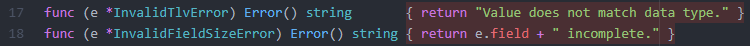

# TLV problem solution

Field | Position | Size
------------ | ------------ | ------------
LENGTH | 0 | 2
VALUE | 2 | LENGTH
TYPO | LENGTH+2 | 3

For this problem the first step is to find the ranges and validate the size of the input.

If that's ok, then validate type of the value.

# Development

For testing use:
```
go test ..\test -coverpkg ./...
```
The coverage is 92.6% of statements, only left untested the return from the errors:

